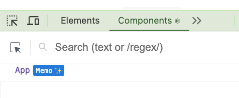

# Creando el proyecto

Si quieres crear el proyecto desde cero, puedes seguir los siguientes pasos:

```bash
npm create vite@latest mi-proyecto --template react-ts
```

Elije React y TypeScript.

Ojo a la fecha que creamos el repo, instalaba todavía la versión 18, vamos a actualizar a la 19.

```bash
npm install react@latest react-dom@latest
```

Y ojo a la fecha que creamos el repo, había que instalar el react compiler, porque estaba en beta, así que vamos a instalarlo.

```bash
npm install --save-dev babel-plugin-react-compiler@beta eslint-plugin-react-compiler@beta
```

```bash
npm install react-compiler-runtime@beta
```

Y configurarlo en en el archivo `vite.config.ts`:

```diff
import { defineConfig } from "vite";
import react from "@vitejs/plugin-react";

// https://vite.dev/config/
export default defineConfig({
  plugins: [
    react(
+    {
+      babel: {
+        plugins: [["babel-plugin-react-compiler", { target: "19" }]],
+      },
+    }
    ),
  ],
});
```

Y ahora arrancamos el proyecto y para ver que esta activo el plugin, si abres las dev tools (pestaña de `Components`), puedes ver que los componentes optimizados tienen unas estrellitas.

```bash
npm run dev
```

Para quitar ruido he borrado imágenes y código que no se usan, y creado un componente `Demo`.



Ya lo tenemos listo así que vamos a empezar a jugar con esto.
